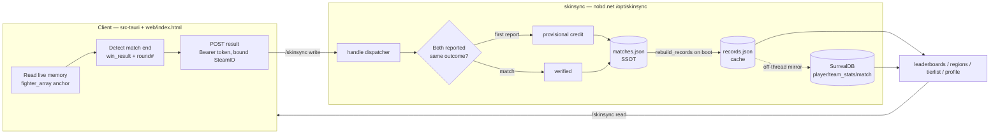

# MetaSync — Architecture (2026-08-15)

MvC MetaSync: a Tauri v2 Windows desktop app for the Steam **MARVEL vs CAPCOM Fighting Collection** (MvC2,
appid `2634890`). It provides a live match overlay (read-only memory), cosmetic palette "skins", a
consensus-verified match leaderboard, and region/represent stats. Three tiers.

## Tiers

1. **Client** — `src-tauri/` (Rust host) + `web/index.html` (UI). Tauri v2 Windows desktop.
   - **Memory is read-only** for match state: everything derives from one confirmed anchor
     `fighter_array = *(exe+0xac6ef0)+0x3f24` + the battle-globals struct (`array+0x2e5dc`). See
     `MVC2-STEAM-EXPERT.md` / `STEAM-FIGHTER-STRUCT-MAP.md`.
   - The **only** writes are cosmetic palette swaps ("skins"). Skins apply by signature, not by side.
   - Reports finished games to the server; fetches opponents' loadouts + leaderboard/region reads.
   - Ships as an NSIS installer; auto-updates via a signed `latest.json` manifest.

2. **Server** — `skinsync/` crate, deployed to nobd.net `/opt/skinsync`. Runs behind the nginx
   `/skinsync/` proxy, binds `127.0.0.1:7250`; nginx terminates TLS + sets X-Forwarded-For (last-hop read
   for the rate limiter). Persistence is plain JSON files (atomic tmp+rename). Per-request `catch_unwind`
   so one panic never takes the process down.

3. **Persistence: JSON SSOT + SurrealDB mirror.**
   - `matches.json` = **single source of truth** (append-only match log).
   - `records.json` = **pure cache**, rebuilt from `matches.json` on every boot.
   - SurrealDB (`ns=maplecast`, `db=skinsuite`; tables `player` / `team_stats` / `match`) is a best-effort,
     off-thread **mirror** that powers the leaderboard reads. It is never the source of truth — a wipe +
     `--migrate` fully repopulates it from the JSON SSOT.

## Server module map (reorg P3)

`main.rs` was split from one ~2,500-line file into 13 behavior-neutral modules (+ `surreal.rs`, untouched),
guarded by 12 golden tests. LOC are approximate.

| Module | LOC | Role |
|---|---:|---|
| `config.rs` | 25 | tunables (TTLs / caps / rate limit) + `now_ms` |
| `cities.rs` | 35 | real-cities load + prefix search |
| `elo.rs` | 55 | `apply_elo` / `replay_elo_and_verified` / `rank_tier` |
| `mirror.rs` | 61 | SurrealDB object literals + the off-thread best-effort mirror |
| `auth.rs` | 71 | `ct_eq` / `admin_ok` / `gen_token` / `auth_steamid` |
| `http.rs` | 86 | `header` / `client_ip` / `cors` / `reply_json` / `read_body` |
| `util.rs` | 166 | env / validation / sanitizers / query parse / base64 / `save_json` / name-rankers |
| `models.rs` | 228 | all serde structs (the JSON-compatible data model) |
| `reconcile.rs` | 255 | frame-derived W/L: gamestate parse → `derive_true_winner` → `apply_correction_swap` → `finish_reconcile` → `reprocess_all` |
| `app.rs` | 395 | the `App` state: load/boot, `parse_matches_or_abort` boot-guard, `rebuild_records`, `disp_name`, presence, eviction |
| `stats.rs` | 453 | read-only aggregates: leaderboards / regions / profile / playerstats / tierlist / matchup / session |
| `routes.rs` | 858 | the `handle()` dispatcher (route-arm **order is load-bearing**) + write handlers |
| `main.rs` | 516 | `main()` + ops flags + the 12 golden tests |
| `surreal.rs` | 271 | the optional SurrealDB HTTP client (unchanged by the split) |

**Route-arm order is significant.** In `handle()`, the `update/` prefix exemption comes first, and
`gamestate/exists` + `gamestate/list` must precede the `gamestate/` catch-all — otherwise the catch-all
would swallow them.

## Core principles

- **Identity is SteamID everywhere** (records / matches / leaderboard / profiles / Surreal ids). Names are
  display-only labels that follow the SteamID (name history kept; Steam-name backfill applied).
- **`App::disp_name(steamid)` is the ONE display-name resolver.** Precedence: Steam-name override >
  most-seen history name > `"Player"`. Nothing reads names off individual match copies.
- **`records.json` is derived, never authoritative.** `rebuild_records()` re-derives every aggregate from
  the `matches.json` SSOT on boot; a corrupt SSOT **aborts** (exit 1) rather than wiping.
- **Consensus verification.** A result becomes `verified` only once **both** participants report the same
  outcome; provisional credit lands on the first report. The wins leaderboard ranks verified wins first.
- **ELO**: K=32, base 1000, zero-sum, floored at 0; replayed chronologically over the SSOT.

## Data flow

Client detects a match from memory → reports it to the server → consensus + ELO decide provisional vs
verified → the result lands in the `matches.json` SSOT → `records.json` (and the Surreal mirror) are
derived from it → read endpoints feed the app's leaderboard / regions / profiles.

## Regions / represent

`locations.json` holds each player's self-declared (opt-in, never IP-inferred) country / region / city;
`cities.json` is a ~69k-city lookup behind the `/cities` prefix search. The `/regions` endpoint plus
country/city filters on the leaderboard + tierlist drive the represent feature, including US "scene"
regions (SoCal, NorCal, PNW, Southwest, Texas, Midwest, Great Lakes, Southeast, Florida, Mid-Atlantic,
Tri-State NYC, New England, Hawaii) and country flags.

## Endpoints (shape)

- **Public reads**: `/skinsync/health`, leaderboards, `/regions`, `/cities`, profile / playerstats /
  tierlist / matchup.
- **Authed writes**: match reports + skin publish/fetch require `Authorization: Bearer <token>`
  (minted at `POST /skinsync/register`, bound to a SteamID; claimed==bound enforced).
- **Admin (x-admin-key, never to clients)**: `/skinsync/admin/stats` (installs / registrations /
  active tokens / online / totals / uptime), `/abuse`, `/gamestate/list` + `/gamestate/<id>` recordings.
