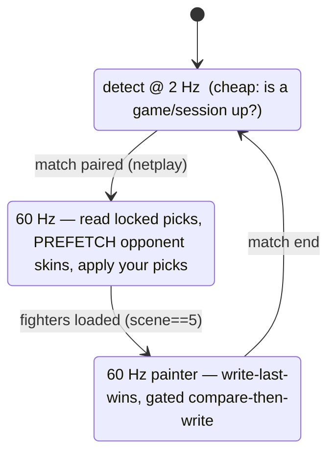

# Phase 3 — Low-latency skin loop (tray agent ⇄ web) — architecture

Design spec for the tray agent + web→agent skin control. **Grounded in the current `sync.rs`/`mem.rs`
RE — this ports proven mechanisms, it does not redesign them.** Written 2026-08-19 by the PWA session
(`rewrite/portable-web-agent`). ⚠ **Do not start the implementation until the 0.2.5 merge lands and
`src-tauri/src/sync.rs` settles** — the tray agent lifts that file's reader/painter verbatim, and it's
currently owned by `nobd-arcade` + `season-ledger`. This is the plan to execute *after* that.

---

## 0. The one principle: keep the network out of the frame loop

The skin "apply" is a **memory write** (microseconds). It must never wait on a network round-trip. So:

> The agent caches your skin **prefs + the actual palette bytes locally**. The 60 Hz paint loop reads from
> that local cache and writes the game's render palette. The network only carries **pref *deltas*** (rare —
> you changed a skin on your phone) and **opponent identity/skins** (once per match, prefetched). Nothing on
> the network is ever in the per-frame critical path.

Everything below serves that principle.

---

## 1. Latency-critical paths + budget

| Path | Pipeline | Budget |
|---|---|---|
| **Your saved skin → screen** (common case) | char-select edge → read local pref → paint | **≤ 1 frame (16 ms)**, zero network |
| **Phone pick → PC** (live change) | web POST → Redis pub → SSE push → agent cache update → next paint | **< 250 ms** (≈ one SSE hop + 1 frame) |
| **Opponent skin → screen** (match start) | netplay-pair edge → prefetch opp skins → cache → paint | **0 ms at apply** (prefetched during char-select) |
| Match result → server | agent → HTTP POST | not latency-critical (100s of ms fine) |

The only path a human perceives as "live" is the phone-pick one, and it's dominated by one SSE hop.

---

## 2. Local-loop optimizations (the hot path, ported + tightened)

**What `sync.rs` already does well (keep verbatim):**
- **O(1) pointer-follow when `scene==5`** (`array = *(exe+0xac6ef0)+0x3f24`) — no ~1 GB scan, no liveness sleep.
- **Adaptive cadence** — 2–3 ms fast poll while active, 300–600 ms idle backoff.
- **Frame dedup** — act only when the frame counter advances.
- **Paint via `paint_slots`** — the exact per-fighter render-palette pointers (`cl+0x4c`), not liveness-gated, so skins paint at match start straight from the pointer (no scan).
- **Write-last-wins** — the game rewrites the render palette each frame, so the painter re-writes after it.

**New tightening (all mechanical, no RE change):**
1. **Coalesce RPM.** `sync.rs` has ~51 `.read()` sites — many small `ReadProcessMemory` syscalls per frame.
   Read the fighter array + globals as **one contiguous block per frame**, parse in-process. Syscall count
   drops ~10×; that's most of the per-frame CPU. (`read_gs_row` already reads 6 slots in a loop — batch
   those into one span where the addresses are contiguous.)
2. **Cache the resolved base + cheap re-validate.** Deref the anchor once, cache the base address, and each
   frame re-validate with a **fingerprint compare** (a couple of stable bytes) instead of re-derefing. Only
   re-deref on a fingerprint miss (relocation/round-reload).
3. **Gate every write.** Paint only when `skin_active && rendered_palette != desired` — a compare-then-write.
   Write the **minimal bytes** (the 6 button-color groups `[0, 0x600)` per the effect-safe paint window),
   never the whole block. A correct frame does zero writes.
4. **Cadence as an explicit state machine** (below) so 60 Hz only runs when it must.

### Cadence state machine

Only `CHAR_SELECT`/`FIGHT` run hot; `MENU` idles at 2 Hz. Transitions are edge-triggered — work happens on
the edge, not every poll.

---

## 3. Command channel (web → agent) — push, never poll

- The agent holds **one persistent SSE** to its own `cmd.{steamid}` channel on the existing gateway
  (`/skinsync/rt/stream/cmd.{steamid}`). Reuses the shipped Redis pub/sub + SSE gateway — no new transport.
- A phone pick → `POST /skinsync/skin/apply {char, skin}` → server publishes to `cmd.{steamid}` → Redis
  (sub-ms) → gateway → agent. Agent updates its **local pref cache**; the painter applies on the next frame.
- **Authz (new, required):** a command channel is per-user and privileged — only *you* may command *your*
  agent. The gateway must verify the subscriber's bearer maps to `{steamid}` before attaching the stream
  (the token already resolves to a SteamID via `auth_steamid`; the gateway needs to enforce it on `cmd.*`).
  Public read channels (leaderboard/matches) stay open; `cmd.*`/`state.*` are token-gated.
- Payloads are tiny JSON (`{cmd:"apply", char:31, skin:"<id>"}`); palettes are ~512 B. No compression, no
  batching needed.

---

## 4. Prefetch — hide the one unavoidable fetch

The opponent's skins are the only per-match network dependency. But the **netplay pairing gives the opponent
SteamID at loading/char-select, *before* fighters load** (already RE'd — deterministic pairing). So:

- On the `MENU→CHAR_SELECT` edge, fire **one** `GET /skinsync/peers` (or the published-skins fetch) for the
  opponent and cache their palettes locally.
- By the time `scene==5` hits, the opponent's skins are already in the local cache → **zero fetch at apply
  time**. Your own picks apply from the pref cache instantly.

---

## 5. Threading model

Three long-lived threads; the painter never blocks on anything but the game.

| Thread | Duty | Rule |
|---|---|---|
| **Reader/Painter** (real-time) | the cadence machine: read block, detect, paint | No heap allocs in the loop, no network, no lock held across a syscall. Reads prefs/opp from an atomically-swapped snapshot. |
| **Net** | SSE command subscription + HTTP match reporting + opponent prefetch | Writes new prefs/opp into a fresh snapshot, then `Arc::swap`s it in. Never touches game memory. |
| **Tray** | tray-icon menu, "Open MetaSync", self-updater tick | UI events only. |

Shared state = one `arc_swap::ArcSwap<Snapshot>` (prefs + opponent skins). The painter reads it lock-free per
frame; the net thread swaps a new one on change. No mutex on the hot path.

---

## 6. CPU / footprint budget

- **No webview** → the 13 %→~2-3 % win by itself.
- Coalesced reads + gated writes + 2 Hz idle → the reader is near-free when not in a fight.
- The **500 Hz `.mctele` recorder stays OFF** unless AI-export is explicitly on (it's the heaviest loop and
  irrelevant to skins).
- `sleep`-based cadence (never busy-spin); the SSE connection is idle-cheap (kept alive by the gateway).

---

## 7. Web side (PWA, `app/` — buildable independently, no game needed)

- A **skin picker / loadout**: per-character skin selection, saved server-side as your prefs (`POST
  /skinsync/skin/apply` for live, a prefs save for defaults). Optimistic UI — show the pick instantly,
  reconcile on ack.
- Skin **preview images** cached by the service worker; keep them small.
- "Agent status" indicator (is your tray agent connected? — derivable from a presence/heartbeat on the
  `cmd.*`/`state.*` channel).

The picker UI can be built and shipped on the PWA **before** the agent exists — it just saves prefs; the
agent consumes them once it ships.

---

## 8. Build order (after 0.2.5 settles)

1. **Extract a shared core** from `src-tauri/`: move the reader/painter/`mem` into a `core` lib crate that
   both the (retiring) Tauri app and the new tray binary depend on — so there's ONE copy of the RE. Do this
   *after* the 0.2.5 merge so the extraction is off a stable `sync.rs`.
2. **Tray binary**: `tray-icon` + `tao`/`muda` shell → status / Open MetaSync / Quit + Windows Run-key
   autostart; drive the core's cadence loop.
3. **Self-updater**: `self-replace` + `minisign-verify` + `ureq` against the existing `latest.json`; apply
   only when no game is running.
4. **Command channel**: gateway `cmd.{steamid}` authz + `POST /skinsync/skin/apply`; agent SSE subscribe +
   local pref cache + prefetch.
5. **Web picker**: the PWA loadout UI (can start now, in parallel — it's `app/`-only).

Steps 1–4 are blocked on the 0.2.5 merge; **step 5 is safe to start today**.
