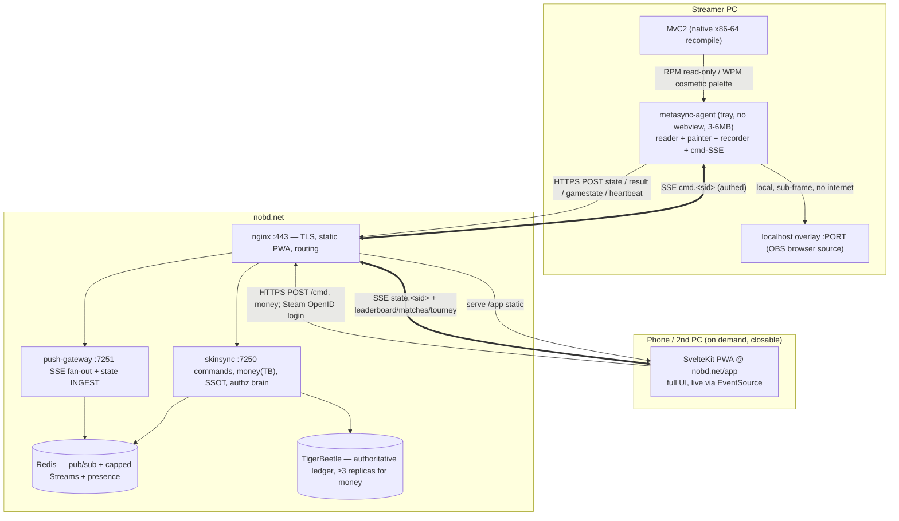

# MvC MetaSync — Portable Rewrite: Master Architecture

Status: **PLAN** (2026-08-19). Synthesized from a six-expert panel (cloud/distributed architect, Redis/NATS, TigerBeetle/ledger, web/PWA, native-agent systems, security/money-safety), each grounded in the real code + 2026 SOTA. This is the target architecture, the resolved cross-expert decisions, and a phased, each-step-shippable build plan.

---

## 0. The two headlines

1. **This is mostly subtraction, not a rewrite.** The current Tauri app already runs *all* memory work in background Rust threads; the ~13% CPU is **WebView2/Chromium rendering the UI + JS poll/paint loops marshaling over IPC every 100 ms** — not the reader. The bus is already channel-generic, the gateway already has a generic `/stream/{channel}` SSE route, the client already has `rt_subscribe`, and in-browser ROM baking already exists. So: **delete the webview, move the UI to a web/PWA, pull the paint loop into Rust next to the reader.** The hard-won RE (`mem.rs`, the offsets table, the anchor method, the recorder) ports **verbatim**. Estimated ~70% repackaging + a handful of genuinely new pieces.

2. **⚠ There is live, exploitable money-loss in shipped 0.2.4 — fix it on the *current* server first, ahead of the rewrite.** Two experts independently confirmed it. See §1. This is the only truly urgent item.

**The target:** a **3–6 MB tray-only native agent** (~0% idle, 2–3% in-match, no webview) + a **SvelteKit PWA on nobd.net** (mobile-friendly, live via SSE, closable while streaming) + the **existing server bus**, with per-user command/state channels. The webview leaves the streaming hot path entirely.

---

## 1. ⚠ URGENT — money-safety patch to the CURRENT server (do this first, not in the rewrite)

The QUARTERS economy (TigerBeetle-backed) is live. The **ledger engine is genuinely well-built** (DB-enforced double-entry, deterministic idempotent transfer-ids, DB-enforced overdraw). The danger is entirely in **what authorizes a transfer** — and both the security and TigerBeetle experts, independently, flagged the same exploitable holes:

| ID | Bug | Where | Fix |
|---|---|---|---|
| **C1** | **Wager pot stealable with one self-report** — `wager::maybe_settle` fires in the `if !applied` (first, unverified, single-client) block; report `winner=self` first → sweep the escrow. Idempotency protects double-pay but **not wrong-pay**; no clawback on later correction. | `routes.rs:1042` | Move settlement to the **verified/consensus** path (`commit_consensus`); settle into a **held (pending)** payout + dispute window; never on first report. |
| **C2** | **Anyone can mint a token for any SteamID** (`is_steamid` is format-only) — defeats *any* both-agree scheme (mint two, "agree" with yourself). Keystone. | `routes.rs:261` | Gate **money-capable** tokens behind a **Steam auth-session ticket** (`GetAuthSessionTicket` → server `AuthenticateUserTicket`) — the native agent is the right place to anchor this (a browser can't mint a native ticket). Cosmetic/leaderboard tokens stay as-is. |
| **W1** | **Non-atomic wager accept → fund loss** — two separate transfers + manual refund; crash between staking the acceptor and persisting `status="locked"` strands the stake in escrow with **no return path**. | `wager.rs:205-211` | TB **linked chain** (`post_pending` challenger + acceptor stake, `flags.linked`) — both land or neither. Model the offer as a **pending hold** that TB auto-voids on timeout. |
| **W2** | **Journal-fallback creates/diverges money** — on TB timeout the op writes the journal *and* the TB worker may also apply → permanent divergence; no reconciler. | `ledger.rs:231-250` | **Fail closed** on TB-unavailable (return "retry"); keep `ledger.jsonl` as audit/DR only. |
| **H2** | Redis has no `requirepass`; TigerBeetle on dev **cluster id 0**; ledger + internet-facing server co-resident. | ops | `requirepass` + ACL; real cluster id; isolate the ledger service account — **money-milestone blockers**. |

**Structural ceiling (both money experts agree):** MvC2 runs entirely on the player's machine — every result is a *client attestation the server cannot verify*. You cannot make a single self-reported memory read trustworthy enough to move real money unilaterally. Therefore: **closed-loop, earn-only, non-cashable "quarters" is the only safe posture.** A cash rail is a **licensing decision** (FinCEN MSB + ~49 state MTLs + BitLicense + gambling analysis), not an engineering one — your BTCPAY-ECONOMY-STUDY's "DO NOT SHIP cash-out" is now confirmed twice. If real dollars are ever wanted: the **TO watch-only BTCPay pass-through** (platform provably never custodies), not a custodial ledger.

**Trust ladder for wagered results** (apply the highest available before releasing money): dual-report **consensus** → **neutral-host oracle** (spectating host reads *their* memory, isn't a party) → **dual-tape corroboration** (both sides' independently-uploaded tapes agree via `reconcile::derive_true_winner`) → server sanity + a **trust factor**. Collusion (two real accounts agreeing) is technically unsolvable → contain economically (small stake caps, per-pair velocity limits, no % cash rake, KYC before any cash-out).

---

## 2. Target architecture — three tiers

- **Tier 1 — Agent** (native, per-PC, always-on): reads gamestate, applies skins (cosmetic palette WPM only), detects results, serves the local OBS overlay. Bus client. **~0% idle, 2–3% in-match.**
- **Tier 2 — Server/bus** (nobd.net, unchanged footprint): nginx + skinsync + Redis + push-gateway + TigerBeetle. Two new capabilities: per-user `state.<sid>`/`cmd.<sid>` channels + **gateway per-user authz**.
- **Tier 3 — PWA** (static, nobd.net/app): the whole UI, opened on demand, closable while streaming.

### The protocol (the one genuinely-new server surface)
- **State (agent→dashboard):** agent diffs its snapshot and POSTs deltas to a new **`/rt/ingest/state` on the async gateway** (Bearer/JWT authed) → `XADD state:<sid>:log` + `PUBLISH state.<sid>`. **Never through single-threaded skinsync** — or we re-create the exact poll load the bus removed. Cadence: publish-on-change, ~1–2 Hz cap in-match, near-zero between games. Snapshot-on-connect via a `/state/<sid>` HTTP read.
- **Commands (dashboard→agent):** dashboard → **authed HTTPS POST `/skinsync/cmd`** → skinsync authorizes (session SteamID == target) → `bus.publish("cmd.<sid>", cmd)` → agent's `cmd.<sid>` SSE. Commands stay on HTTP; only push uses SSE. **Money is never a bus command** — QUARTERS actions are authed HTTP → skinsync → TigerBeetle.
- **Idempotency:** every command carries `cmd_id` + `ts`; agent dedupes by id, **latest-wins + drop-if-older-than-~30 s** (guards against a stale skin replaying after the agent was offline). Skin writes are naturally idempotent.
- **Apply-skin round-trip:** dashboard click → pixel ≈ **50–90 ms typical, <300 ms p95.** Perceptually instant.

---

## 3. Resolved cross-expert decisions

| Decision | Resolution | Why |
|---|---|---|
| **Redis vs NATS** | **SSE + a signed-JWT gateway now; NATS as an earned upgrade later.** | 2 of 3 (cloud architect + security) favor it: it closes the per-user-authz gap *today* with zero new infra, reuses the shipped path, and — because **money never rides the bus** — the "JetStream durable command delivery" argument only applies to *cosmetic* skins (naturally idempotent + latest-wins). Adopt NATS when broker-level authz, HA-eventing, or multi-node clustering actually earn it (the Redis expert's Phase-4). |
| **Per-user authz** | Short-lived **HS256 JWT** (`{steamid, exp}`, secret shared skinsync↔gateway), minted at `/skinsync/rt-token`. Gateway checks `channel ∈ {cmd.<jwt.sid>, state.<jwt.sid>}`; public channels pass through. **Never let the client name the target channel** — derive it from the token. | Stateless, no per-connect round-trip, closes the world-open gateway (C3/H4). |
| **Frontend stack** | **SvelteKit 5 (runes) static SPA + `vite-plugin-pwa`**, served **same-origin at `nobd.net/app`**. | Fine-grained signals kill the CPU tax *and* an entire bug class (the "tick-rebuild wipes DOM" pain the design bible warns about). Same-origin erases CORS + cookie headaches; UI ships via `rsync` — **no `cargo tauri build` per change.** |
| **Client transport** | Browser connects **directly via native `EventSource`** — the Rust SSE bridge (`rt_subscribe`/`emit`) **is deleted**. HTTP `fetch` for commands. | The gateway already serves `/stream/{channel}` with CORS. The browser is *simpler* than Tauri here. |
| **Agent framework** | **Pure Rust binary: `tray-icon` + `tao` + `muda` + `notify-rust`. NOT minimal Tauri.** | Any Tauri target links a webview — the exact 100–300 MB dependency we're shedding. Same tray stack Tauri uses internally. |
| **Auto-update** | Keep the **minisign/`latest.json`** flow (`minisign-verify` + `self_update`), drop the Tauri plugin. Windows: single self-contained `.exe` (no NSIS/WebView2 bootstrapper). Linux: plain binary (no AppImage — clean self-replace on immutable distros). | Sheds Chromium + the AppImage-swap unreliability; keeps the signing key + endpoints unchanged. |
| **OBS overlay** | **localhost-direct** for the streamer's own overlay (agent serves a few-KB static page + local SSE → frame-accurate, offline/LAN-capable, tiny CPU). **`nobd.net/app/overlay/[sid]`** as the server-relayed route for spectators/phone (~0.3–1 s, glanceable). | Frame-accurate data is *local* — don't send it to the cloud and back. Server route reaches any device. |
| **ROM bake / Studio** | **Move to the web** (FS Access API, Chromium desktop) — the JS bake already exists behind `platform.mjs`. **Delete `rom.rs`, the `rom_*` commands, `tauri-plugin-dialog`, the `zip` crate** from the agent. | Makes "the only writes are cosmetic palette WPM" *literally* true. Mobile never bakes ROMs; desktop-Chromium-only is fine for a BYOR authoring task. |
| **Steam-ticket identity** | The **agent** anchors "this is SteamID X" via `GetAuthSessionTicket` (`steamworks-rs`) → server `AuthenticateUserTicket`. | Independently recommended by both security and native-agent experts. A browser can't mint a native ticket → the agent is the right anchor. Directly the C2 fix. |
| **SurrealDB** | **Delete candidate** — reads are already off it; the JSON path serves everything. Simplify, don't invest. | (Cloud architect.) |

---

## 4. The CPU fix, concretely (the whole point)

The agent's memory work is already cheap; the wins are **fewer syscalls + no webview**:
1. **Delete the webview** — removes the 100–300 MB + the continuous-render cost. (Biggest win.)
2. **Coalesce reads** — `read_gs_row` issues ~30 individual `RPM` syscalls/cycle; replace with **one ~11 KB read of the whole fighter-array block** + parse in-process. ~30 syscalls → ~1–2.
3. **Recorder 3 ms (333 Hz) → 8 ms (125 Hz)** — 2× Nyquist for 60 fps still catches every frame; with coalescing, recorder syscalls drop from ~10 k/s to ~125/s. **This alone likely lands the budget under 2%.**
4. **PWA rendering discipline** — event-driven (signals = ~0 idle CPU), no infinite keyframes (one-shot flashes on delta), `visibilitychange` pause, `content-visibility:auto`, virtualized lists, `prefers-reduced-motion`.

**Footprint:** 3–6 MB binary · 15–35 MB RAM · ~0% idle · **2–3% in-match** (from 13% + 150–300 MB).

---

## 5. Security controls (beyond §1's money fixes)

- **Command channel is a closed enum** — `ApplySkin{side, skin_id|colors}`, `ClearSkin{side}`, `SetEffect`, `Ping`. **No address/bytes variant exists.** The agent resolves the write target itself off its own anchored array; content is structurally a 32-byte ARGB4444 row from 16 colors. Existing gates stay (`is_wb` range, `is_real_row` + read-back, extent-limited to base region + learned rows). **Server compromise → worst case is a cosmetic recolor, never arbitrary memory.**
- **Pairing** — zero-touch when the agent's local SteamID matches the browser's Steam-OpenID login (server links them); 6-digit fallback otherwise. A stolen token used elsewhere shows as a *second instance* → surface + revoke.
- **Web app** — strict **CSP** (`script-src 'self'`, nonce the inline block, `object-src/base-uri 'none'`, tight `connect-src`), output-encode every user sink (names/titles/**rules markdown**/banners), **short access token + httpOnly `Secure` refresh cookie** (not a 180-day localStorage bearer → gains revocation/rotation), CSRF on cookie routes.
- **Server** — `requirepass` Redis, TB off cluster-0 + separate service account, gateway connection caps + CORS allowlist (not `*`) once any channel is private, individual admin identities + MFA + audit log for money/result actions.

---

## 6. Phased build plan (each phase shippable; old app + new stack share one server SSOT, so never a broken interregnum)

**Phase 0 — the money patch (URGENT, current server, NOT the rewrite).** §1: settle-on-verified + held payout (C1), Steam-ticket gate for money tokens (C2), linked-chain accept + pending-hold offer (W1), fail-closed TB (W2), `requirepass` + real TB cluster id (H2). Ship to the live server this week.

**Phase 1 — PWA read-only mirror.** SvelteKit SPA at `nobd.net/app`; port the ARENA design system to components; `SseChannel` manager + rune stores against the **live** public channels (leaderboard/presence/matches/tourney/tourney_index). Read-only board + regions + shareable profile (`/u/[sid]`) + tournament browse/detail. **Value now: check your rank/tournament on your phone.** No client change.

**Phase 2 — Auth + identity.** Steam OpenID web session → httpOnly cookie + `/me`; per-user `alert` routing; the identity card.

**Phase 3 — Per-user channels + gateway authz + command loop.** `/skinsync/rt-token` (JWT), gateway per-user authz, `/rt/ingest/state`, `state.<sid>`/`cmd.<sid>`, `/skinsync/cmd`. **Dogfood via the desktop app's own skin buttons first** (webview → server → same machine's paint path) before exposing to the PWA. Then live match view + apply-skin-from-web.

**Phase 4 — the Agent.** New `metasync-agent` crate: port `mem.rs` + offsets + anchor + reader + recorder + paint + auth + SSE **verbatim**; add the tray + the coalesced reads + the internal paint/record loops + the cmd dispatcher; drop the webview + ~80 Tauri commands + `rom.rs` + the D3D hook + the 500 Hz diagnostic capture. Localhost overlay. Ship *alongside* the full app (two targets, one codebase).

**Phase 5 — Economy + Studio + push.** QUARTERS/wagers on web (with the §1 settlement model), Web Push (VAPID) for match-ready/wager-settle, the browser Studio (FS Access bake).

**Cutover.** When the PWA is at parity and the agent is stable, the **tray-agent becomes the default install**; the webview build survives only as an optional legacy "local UI" mode. The updater's dual-endpoint flow carries the agent unchanged.

---

## 7. Tech stack (2026-verified)

- **Agent:** Rust — `tray-icon` 0.21 / `tao` 0.34 / `muda` / `notify-rust`; `ureq` 3 (HTTP + SSE); `minisign-verify` + `self_update`; `steamworks` (auth ticket); keep `windows`/`libc`/`flate2`/`serde`. Drop `tauri*`, `tauri-plugin-dialog/updater`, `zip`.
- **Web:** SvelteKit 2 / Svelte 5 (runes) / Vite 7 / TS 5, `adapter-static` (SPA), `vite-plugin-pwa` (Workbox 7, `injectManifest`), `@tanstack/svelte-virtual`, native `EventSource`, FS Access API, Web Push/VAPID (server-side Rust `web-push`).
- **Server:** unchanged footprint — Redis 8.x (`requirepass`), `axum` push-gateway (+ state ingest + JWT authz), `skinsync` tiny_http (+ `/cmd`, `/rt-token`), **TigerBeetle ≥3 replicas + real cluster id before real money**. NATS held for a later phase. SurrealDB → delete candidate.

---

## 8. Overkill check (honest)

**Genuinely necessary:** the webview split (the actual CPU driver); the §1 money-safety patch (live exposure); gateway per-user authz before `cmd`/`state`; state-ingest on the async gateway; the closed command enum; ≥3-replica TB before real money; the rate-limiter read/write split (already shipped — becomes *more* urgent with agent+dashboard on one household IP).

**Overkill / defer at this scale:** NATS (no capacity need; SSE+JWT suffices now); Redis-as-state-store / multi-instance skinsync; a cash-out rail (licensing, not engineering — keep closed-loop); multi-region HA (do **backups + a restore runbook**, not a second region); kernel anti-cheat (disproportionate; the answer is "server refuses to move money on one client's word," not client anti-tamper).

**Net:** ~70% repackaging of shipped, validated code into three deployables + two new server capabilities (`state`/`cmd` channels + gateway authz) + one elegant client split (localhost overlay vs server-relayed) + a money-safety patch that should ship *before* the rewrite. The push/delta model — the real scaling win — is already live; the portable rewrite rides on top of it.
