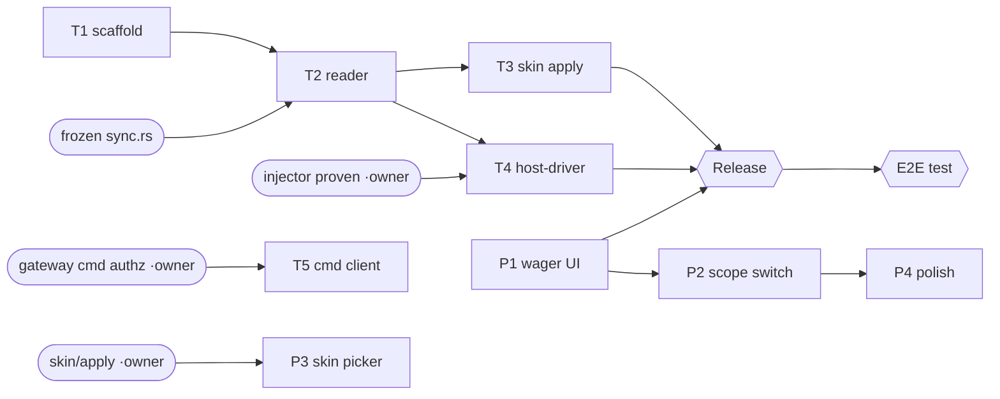

# MetaSync — Tauri → (tray agent + PWA) cutover: full workstream plan to release

Master plan to take the rewrite to completion/release/test. Written 2026-08-19. Owners: **PWA/tray = this
session**; **server/injector/RE = the nobd-arcade owner** (see memory `mvc-arcade-tray-contracts`). 0.2.5
(game-modes + wagers/arcade) shipped on the Tauri app; this plan retires it.

## Definition of done
The Tauri desktop app is fully replaced by **PWA (nobd.net/app) + tiny tray agent**, released with
auto-update, and proven end-to-end: a hosted arcade match runs, a wager settles, skins apply, matches report
— all with no webview.

## Lanes, tasks, status (⬜ todo · 🔄 in progress · ✅ done · ⛔ gated)

### Lane P — PWA (this session, `metasync-rewrite/app`, ONE sequential lane — shared worktree)
| # | Task | Status | Blocks/needs |
|---|---|---|---|
| P0 | Read/social app (ranks, match, tournament, regions, library, profiles, auth, actions, settings) | ✅ live | — |
| P1 | **Wager/marquee UI** (balance, MARQUEE, rail, quarter-up, staked-tourney badges) | 🔄 building | live endpoints (have) |
| P2 | Scope switcher (Ranked/Lobby/Tournament boards) — `?scope=` is live; 0.2.5 UX now frozen | ⬜ | after P1 |
| P3 | **Skin picker / loadout UI** (per-char selection, optimistic) | ⛔ | needs S3 (skin-apply endpoint + agent) |
| P4 | Polish: notification prefs, a11y, bracket render w/ real data | ⬜ | after P1/P2 |

### Lane T — Tray agent (this session, NEW worktree `mvc-live-skins-tray`, RUNS PARALLEL to Lane P)
| # | Task | Status | Blocks/needs |
|---|---|---|---|
| T1 | **Scaffold**: crate + port `mem.rs` verbatim (0 Tauri coupling) + tray shell (`tray-icon`/`tao`/`muda`: status/Open MetaSync/Quit + Run-key autostart) + self-updater skeleton (`self-replace`+`minisign-verify` vs existing `latest.json`) | 🔄 starting | — (parallel now) |
| T2 | **Memory-reader port** (game-bridge subset of `sync.rs`: cadence machine, gamestate, match reporting) | ⛔ | **frozen `sync.rs` commit** (confirm which shipped) |
| T3 | **Skin applier** (paint loop, write-last-wins, `paint_slots`) port | ⛔ | frozen `sync.rs` |
| T4 | **Arcade host-driver**: `read_my_lobby` (⚠ **1GB region cap 0x4000_0000**) + drive injector via `nobd_arcade.cmd/result/ready` file protocol + host heartbeat | ⛔ | frozen `sync.rs` + **injector proven live** (owner) |
| T5 | **Command-channel client** (SSE `cmd.{steamid}` → apply skins live) | ⛔ | S4 gateway authz |

### Lane S — Server / injector / RE (nobd-arcade OWNER — coordinate, don't build)
| # | Task | Status |
|---|---|---|
| S1 | Wager economy + endpoints (coins/wager/marquee/staked-tourney/ledger) | ✅ live |
| S2 | **Injector menu-drive proof** (capture-replay cycle) — the gate for T4 | 🔄 owner |
| S3 | Skin-apply endpoint (`POST /skin/apply`) — the gate for P3 | ⬜ (define w/ owner) |
| S4 | Host registry (enroll/heartbeat/hosts + fee routing) + gateway `cmd.*` authz | 🔄/⬜ owner |

## Dependency graph

## What runs in parallel NOW (no shared-resource collision)
- **Lane P** (wager UI, agent running in `app/`) **‖** **Lane T1** (tray scaffold, agent in the separate
  `mvc-live-skins-tray` worktree). Different repos/worktrees → no dev-server/build collision.
- Sequential within Lane P (one `app/` worktree). Sequential within Lane T after T1 (one tray worktree).
- Lane S is the owner's; we consume + coordinate.

## Gates to unblock the rest (who clears them)
1. ✅ **Frozen `sync.rs` — RESOLVED:** the `v0.2.5` release tag = commit **`02f8883`** ("game modes +
   scoped leaderboards + arcade gs-218"); its `sync.rs` carries both the game-modes reader AND the arcade RE
   (`read_my_lobby` + 1GB cap). Tray worktree `mvc-live-skins-tray` [branch `tray-agent`] is based off it →
   **T2/T3/T4 code is unblocked** (T4's *live* test still waits on the injector, gate #2).
2. **Injector proven live** (owner, S2) → unblocks T4 end-to-end.
3. **`POST /skin/apply` + `cmd.*` gateway authz** (owner/server, S3/S4) → unblocks P3 + T5.

## Release + test
- **Tray build/sign/publish:** `cargo build --release` → sign with the existing minisign key
  (`~/.mvc-updater/signing.key`) → add the tray entry to `latest.json` on nobd (`/opt/skinsync/update/`).
  Self-updater applies only when no game is running.
- **E2E test (multi-party):** injector capture-replay (owner) → tray T4 drives a hosted lobby → 2 players
  join via `steam://joinlobby/…` → a real match → wager settles (memory-read referee) → skin applies →
  result reports. Verify on Windows + Bazzite/Proton.

## Coordination points (keep synced with the owner)
1. Injector `cmd/result/ready` file protocol — one driver (tray), one contract.
2. Host-registry + `cmd.*` gateway endpoints — owner defines, tray/PWA wire the client.
3. Reader offsets / 1GB region cap — shared; re-verify both sides if the game updates.
